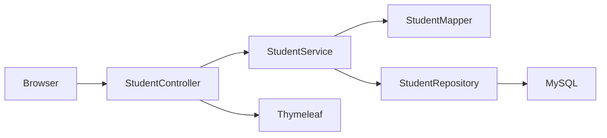

# Student Management

A small web application for managing student records. You can list, create, view, edit, and delete students through a browser UI. The backend is a classic Spring Boot MVC app with server-rendered HTML (Thymeleaf) and a MySQL database.

## Features

- **List students** — table view of all students with quick actions
- **Add student** — form with server-side validation (required fields, email format)
- **View student** — read-only detail page for a single record
- **Edit student** — update name, surname, and email
- **Delete student** — remove a record from the database

Validation runs on the server using Jakarta Bean Validation. Invalid submissions show error messages on the same form without losing user input.

## Tech stack

| Layer | Technology |
|-------|------------|
| Runtime | Java 17 (compiler target; see `pom.xml`) |
| Framework | Spring Boot 4.0.6 |
| Web | Spring Web MVC, Thymeleaf |
| Persistence | Spring Data JPA, Hibernate |
| Database | MySQL |
| Mapping | MapStruct |
| Boilerplate | Lombok |
| UI | Bootstrap 5 (CDN) |
| Config | `.env` file via [spring-dotenv](https://github.com/paulschwarz/spring-dotenv) |

## How it works

The app follows a layered design: the controller handles HTTP and views, the service holds business logic, and the repository talks to the database. DTOs are used in the web layer; JPA entities are used for persistence. MapStruct converts between them.



**Request flow (example: create student)**

1. `GET /student/new` — controller adds an empty `StudentDto` to the model and returns `create_student.html`.
2. `POST /student/new` — form data binds to `StudentDto`. If validation fails, the create page is shown again with errors.
3. On success, `StudentService` maps the DTO to a `Student` entity and saves it via `StudentRepository`.
4. The browser is redirected to `GET /student/all`.

Hibernate creates or updates the `student` table automatically (`spring.jpa.hibernate.ddl-auto: update`). SQL logging is enabled in development (`show-sql: true`).

## Data model

| Column | Type | Constraints |
|--------|------|-------------|
| `id` | `BIGINT` | Primary key, auto-generated |
| `name` | `VARCHAR` | Not null |
| `surname` | `VARCHAR` | Not null |
| `email` | `VARCHAR` | Not null, unique |

## Routes

| Method | Path | Description |
|--------|------|-------------|
| `GET` | `/student/all` | List all students (main entry point) |
| `GET` | `/student/new` | Show create form |
| `POST` | `/student/new` | Save new student |
| `GET` | `/student/{id}/view` | View one student |
| `GET` | `/student/{id}/edit` | Show edit form |
| `POST` | `/student/{id}/edit` | Update student |
| `GET` | `/student/{id}/delete` | Delete student |

There is no home page at `/`; open [http://localhost:8080/student/all](http://localhost:8080/student/all) after starting the app.

> **Note:** Delete uses `GET` for simplicity in this learning project. In production, prefer `POST` or `DELETE` with CSRF protection.

## Project structure

```
src/main/java/com/springboot/studentmanagement/
├── StudentManagementApplication.java   # Entry point
├── controller/
│   └── StudentController.java          # MVC endpoints & views
├── service/
│   └── StudentService.java             # CRUD operations
├── repository/
│   └── StudentRepository.java          # Spring Data JPA
├── entity/
│   └── Student.java                    # JPA entity
├── dto/
│   └── StudentDto.java                 # Form/API shape + validation
└── mapper/
    └── StudentMapper.java              # MapStruct Entity ↔ DTO

src/main/resources/
├── application.yaml                    # Spring & datasource config
└── templates/                          # Thymeleaf HTML pages
    ├── students.html
    ├── create_student.html
    ├── edit_student.html
    └── view_student.html
```

## Prerequisites

- **JDK 17** or newer
- **Maven 3.9+** (or use the included `./mvnw` wrapper)
- **MySQL 8** (or compatible) running locally or reachable from your machine

## Setup

### 1. Create the database

```sql
CREATE DATABASE student_management;
```

You can use any database name; match it in your JDBC URL below.

### 2. Configure environment variables

Copy the example env file and fill in your MySQL credentials:

```bash
cp .env.example .env
```

Edit `.env`:

```properties
DATABASE_URL=jdbc:mysql://localhost:3306/student_management
DATABASE_USERNAME=your_mysql_user
DATABASE_PASSWORD=your_mysql_password
```

Spring loads this file via `spring.config.import: file:.env[.properties]` in `application.yaml`. Do not commit `.env` to version control (it should stay local).

### 3. Run the application

```bash
./mvnw spring-boot:run
```

On Windows:

```cmd
mvnw.cmd spring-boot:run
```

The app starts on the default port **8080** unless you override `server.port`.

### 4. Open the UI

Visit: [http://localhost:8080/student/all](http://localhost:8080/student/all)

## Configuration

Key settings in `src/main/resources/application.yaml`:

| Property | Value | Purpose |
|----------|--------|---------|
| `spring.datasource.url` | `${DATABASE_URL}` | JDBC URL from `.env` |
| `spring.jpa.hibernate.ddl-auto` | `update` | Sync schema with entities |
| `spring.jpa.show-sql` | `true` | Log SQL to console |

For production, use `ddl-auto: validate` or migrations (e.g. Flyway/Liquibase) instead of `update`, and turn off `show-sql`.

## Running tests

```bash
./mvnw test
```

The included test loads the Spring context (`StudentManagementApplicationTests`). It does not require MySQL unless you add integration tests that hit the database.

## Building a JAR

```bash
./mvnw clean package
java -jar target/student-management-0.0.1-SNAPSHOT.jar
```

Ensure `.env` is present in the working directory (or export the same variables in your environment).

## License

This project is for learning and side-project use. Add a license file if you plan to publish or share it publicly.
